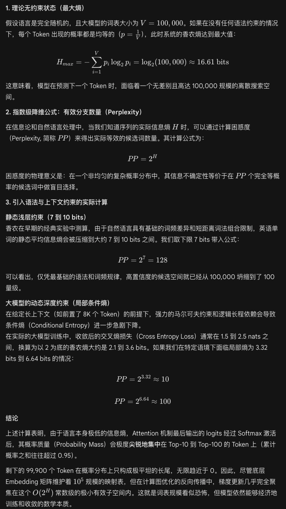

# The Old Guard Before Attention
 
Traditional sequence-processing approaches (pre-2017) fall into two main categories:
- **RNN**: Words are fed into the model one at a time. The model itself is a state machine, updating its hidden state at every step.
- **CNN**: Slides a window across the sequence and uses convolution to extract local features.

 
From today's vantage point, neither of these architectures scales gracefully with growing compute. RNNs are inherently sequential—processing time grows unboundedly with sequence length, and they cannot compute information across the whole sequence in parallel. CNNs have to roll their kernels across the entire sequence, and worse, since the receptive field stays fixed as sequences grow longer, they impose a strong inductive bias that leads to severe overfitting. Neither can extract $O(n)$ returns from compute scaling, which hard-caps the ceiling of these technical paths. Many papers and blog posts will tell you, ad nauseam, that now that we have sufficient compute and data, models like Attention—with their global field of view—can better leverage GPUs to accelerate training, blah blah blah, and therefore Attention ought to outperform its predecessors.
 
# The Strong Assumptions That Make Attention Work
 
The mechanism of Attention is: "First attend to both the context and the current position, then compute the most reasonable prediction." It dynamically computes attention weights from context, then determines which tokens have the highest generation probability at the predicted position. But almost no paper or blog post explains *why* Attention is so effective on language modeling, while making barely a ripple in the traditional strongholds of RNNs and CNNs—time-series forecasting. Many practitioners build models without keeping in mind the strong assumptions that underpin Attention's effectiveness. Let's spell them out explicitly:
 
1. Tokens admit extremely high-information-density discrete representations, which allows vocabularies to be trained economically.
In reality, the vocabulary size of any human language is exceedingly limited compared to modern storage scales. Chinese has only about 400,000 words and 85,000 characters, of which the commonly used set accounts for less than 5%. English has about 1 million words in total, but native speakers typically command only 20,000–30,000, and mastering 2,000–5,000 high-frequency words is enough to cover most everyday conversation and reading material. If we apply morphological decomposition—splitting words into stems, prefixes, and suffixes via more reasonable matching—the vocabularies built into top-tier LLMs end up at no more than the $10^{6}$ order of magnitude. That number may sound staggering, but compare it to the totality of human writing and conversation and it's actually quite modest.
 
Words themselves are extremely low-entropy, high-information abstract embeddings of the objects, concepts, and logical structures of the world. Model training also relies on efficient tokenizers (such as the BPE algorithm) and finite vocabularies to forcefully discretize and semantically compress data, combining scattered characters or signals into representational units of high information density. Even today's strongest LLMs need only word-embedding dimensions on the order of ~$10^{4}$, and early models needed only ~1,000 dimensions. This precisely demonstrates that the modest size of the vocabulary is what makes everything tractable under current compute budgets.
 
2. Grammar itself is a powerful logical prior, which means a finite context window suffices to obtain decent results.
Anyone who has studied position encoding knows that vanilla Attention is mathematically permutation-invariant—swapping the order of tokens does not change the result of the computation. This, in reverse, reveals that language sequences carry extraordinarily effective logical inductive information. The grammatical rules and fixed expressive paradigms of natural language directly impose powerful Markovian constraints on the sequence.
 
Information-theoretic measurements estimate the actual Shannon entropy of human language sequences at only 7–10 bits/word. This means that, given some preceding context, the probability distribution of the next token in embedding space is exceedingly sparse. This extremely low effective information entropy fundamentally erases the randomness of token combinatorics and grants the sequence a powerful structural prior. It guides the weight distribution of the $Q K^T$ matrix in Attention to naturally become sparse, rapidly converging onto the local dependencies and long-range correlations between tokens that conform to grammatical structure.
 

 
As a result, within a finite context window on the order of 8K to 128K, the model can already capture sufficient conditional probability paths to approximate the macroscopic logical closure of human language. Strip away those grammatical constraints and confront the model with a fully random, high-entropy sequence, and today's context sizes would be utterly incapable of supporting Attention in extracting any meaningful features within the compute wall.
 
# The Capability Boundaries of Attention
 
Based on this analysis, we can see that Attention only earns its keep within a finite context when the underlying data can be losslessly—or near-losslessly—compressed into high-information-density, finite-scale discrete representations. If the task itself is high-entropy, continuous, or lacks strong grammatical structure, forcibly carving it into tokens not only sheds core information but also pushes Attention into pure noise-matching and the curse of dimensionality. Below are several categories of tasks for which relying solely on Attention is fundamentally unsuitable:
 
1. High-frequency continuous time-series prediction (e.g., financial tick data, meteorological and seismic sensor data)
- Boundary conflict: This kind of data is a pure continuous stream of real numbers, riddled with Brownian-motion-style random walks and white noise. There is no analogue to the finite vocabulary of natural language, and the signals are severely lacking in fixed grammatical constraints (low effective information entropy).
- Consequences of forced tokenization: If you forcibly bin continuous numerical values into discrete tokens, either the bins are too coarse and critical fine-grained fluctuations are lost, or they are too fine, the vocabulary explodes, and each token's occurrence probability flattens toward uniform (high entropy). Without structured priors, Attention's global routing easily latches onto local random noise, and predictive performance often falls behind simple linear regression models (such as ARIMA) or the CNNs/RNNs that excel at extracting local continuous features.
2. Unprocessed raw physical signals (raw audio waveforms, pixel-level video streams)
- Boundary conflict: Raw physical signals have extremely high sampling rates (e.g., 44.1 kHz audio means 44,100 data points per second; or 4K 60fps video). The information density of a single sample point (a single pixel or acoustic amplitude) is extremely low, and on its own carries no independent semantic meaning.
- Consequences of forced tokenization: If raw sample points are fed directly as input, the sequence length $N$ explodes instantly and slams into Attention's $O(N^2)$ compute wall. If you skip downsampling and instead just truncate the context, the physical time window the model can see shrinks to a length too short to extract any macro-level features.
- Industry compromise: Today's large audio–video models (such as Sora or modern speech models) absolutely do not let Attention touch raw signals directly. They first use VAE (Variational Autoencoder) or VQ (Vector Quantization) techniques to forcibly package and cluster continuous signals within a latent space into discrete patches or acoustic pseudo-vocabularies. This is itself proof of Attention's helplessness when processing continuous signals.
3. Continuous closed-loop control of high-degree-of-freedom physical systems (e.g., complex robotic kinematic control, high-frequency low-level autonomous-driving execution)
- Boundary conflict: Continuous control signals in the physical world (such as motor current outputs or fine-grained continuous adjustments to steering angle) demand extreme smoothness and real-time feedback. Such tasks not only have continuous state spaces, but their correctness depends heavily on partial-differential-equation constraints from physical law, rather than on statistical co-occurrence probabilities.
- Consequences of forced tokenization: Forcibly discretizing continuous physical action outputs into tokens introduces unacceptable quantization error at the execution end, leading to high-frequency jitter in robotic arms or divergence of control loops. Attention's global receptive field provides no benefit here; on the contrary, its computational latency disrupts the real-time closed loop of the control system. Such tasks remain firmly the domain of reinforcement learning (combined with MLPs or Actor–Critic architectures over continuous action spaces), and even traditional PID control.
  
In summary, when the essence of the information is continuous variation, high-frequency oscillation, and lacks the statistical convergence of grammar-like structure, forcibly imposing discrete tokens (tokenization) amounts to destructive compression. In a desert without high-information-density tokens to lean on, Attention's global search capability has nowhere to deploy itself.